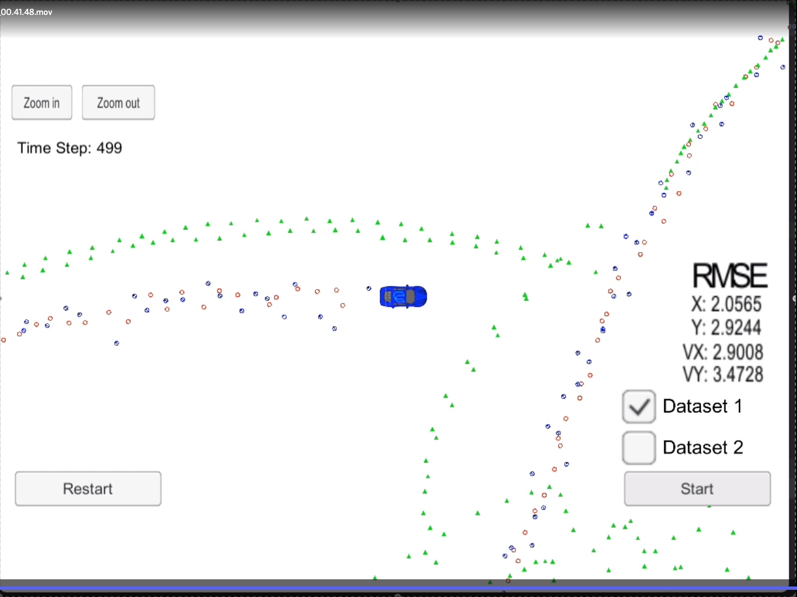

# Thoughts and lookbacks about my code
While pretty much basic, thanks to the building blocks from previous lesson, this netherheless managed to stump me for a
while, thanks to a faulty assumption I made about a key step. I realised pretty quickly if I used `atan2` instead of `atan`
I would 'not need to normalize' it to fit between -π and π.  This lead to this happening when I ran the simulator:

(Image taken from video I recorded of the failure, which can be found [here](images/fail.mov))

I eventually realised that the fact it failed precisely when the car had reached a 180 from the start meant the normalization
was not working as I intended, and looking into it I realised I needed to do that after the step where I subtracted the 
polar cordinate version of x from the measurements.

Once I went through this hurdle I was able to finish the project pretty easilly, with a prediction I am happy with.
